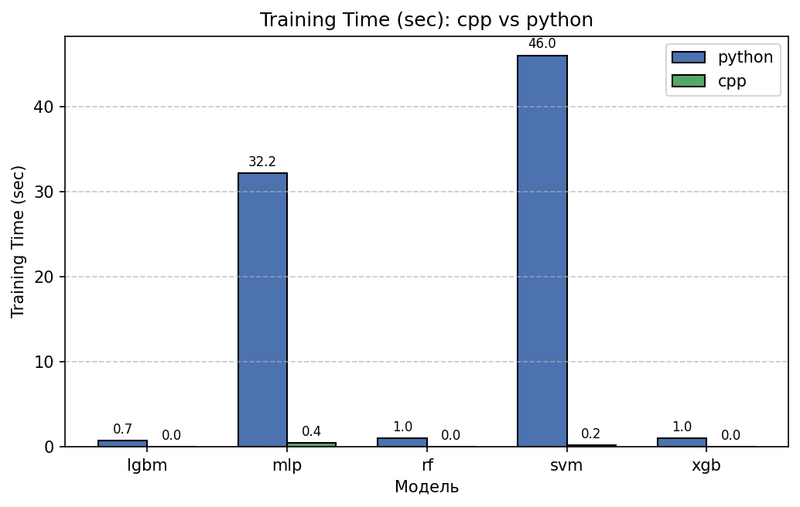
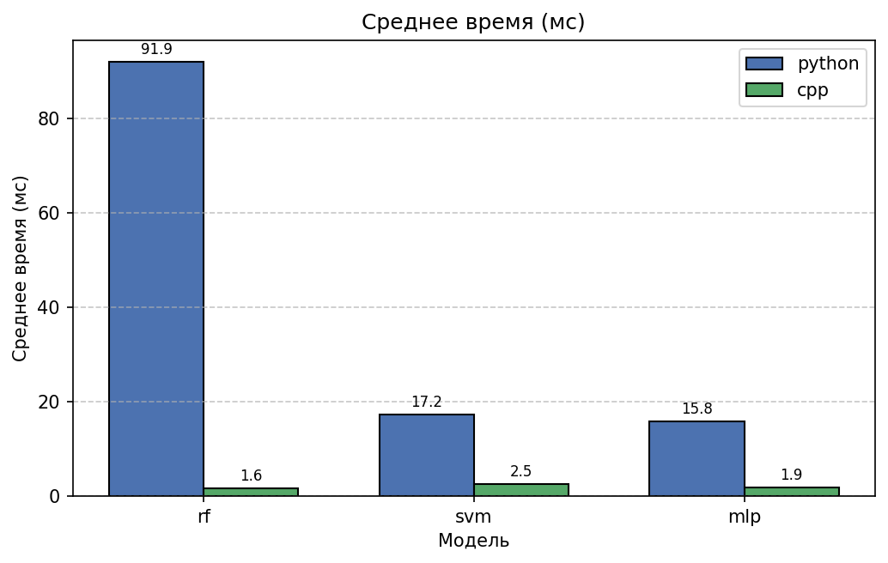
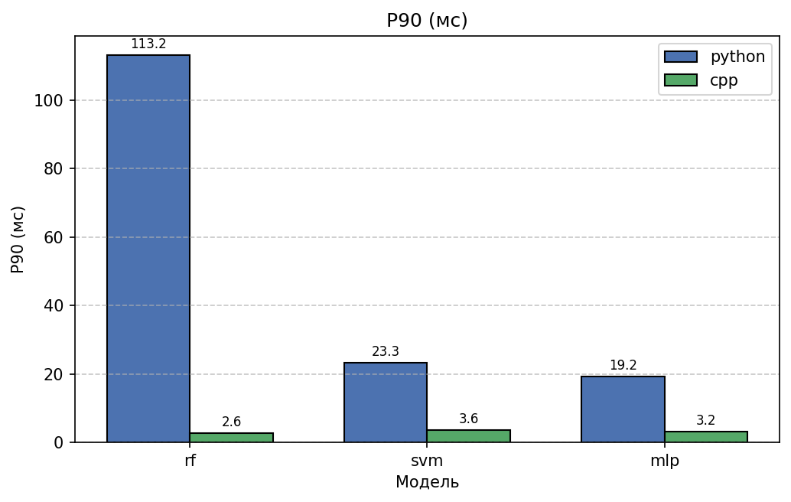

#Needed #Research

---
## План статьи

1. **Введение**  
   - Актуальность ML в кибербезопасности  
   - Задача: NIDS на базе NF-UNSW-NB15  
   - Цель: сравнить Python и C++ по обучению и инференсу  

2. **Методология**  
   - Данные: NF-UNSW-NB15-v2  
   - Модели: RF, SVM, MLP (xgb/lgbm — как baseline в Python)  
   - Метрики: accuracy, F1, время обучения, latency (mean/p90/p99), RPS, точность детекции атак  
   - Инфраструктура: одинаковые машины, одинаковые параметры препроцессинга  

3. **Реализация**  
   - Обучение: единый pipeline предобработки  
   - Инференс: HTTP-сервисы, одинаковый API  
   - Тестирование: нагрузка с чередованием безопасных/атакующих пейлоадов  

4. **Результаты**  
   - Обучение: время, качество  
   - Инференс: latency, throughput, стабильность  
   - Анализ ошибок: ложные срабатывания, пропуски атак  

5. **Обсуждение**  
   - Trade-offs: разработка vs производительность  
   - Когда выбирать Python, когда — C++  
   - Влияние ONNX, Drogon, native-реализаций  

6. **Заключение**  
   - Итоги  
   - Рекомендации для production-сред  
   - Направления будущих исследований  

7. **Приложения**  

---

### Введение

Современные системы кибербезопасности всё чаще полагаются на методы машинного обучения для обнаружения аномалий и атак в сетевом трафике. Особенно востребованы решения, способные работать в реальном времени: Network Intrusion Detection Systems (NIDS) должны анализировать потоки данных с минимальной задержкой и высокой точностью. Однако выбор языка программирования для реализации таких систем остаётся предметом дискуссий. Python доминирует в исследовательской фазе благодаря богатой экосистеме (scikit-learn, XGBoost, ONNX Runtime), но C++ традиционно считается более подходящим для production-развёртывания из-за предсказуемой производительности и низких накладных расходов.

В данной работе мы проводим строго контролируемое сравнение Python и C++ в контексте полного жизненного цикла NIDS: от обучения модели до высоконагруженного инференса. Мы используем единый датасет (NF-UNSW-NB15-v2), идентичные параметры предобработки и одинаковый набор моделей (Random Forest, SVM, MLP), чтобы изолировать влияние языка от других факторов. Особое внимание уделяется не только latency, но и точности детекции при чередовании нормального и вредоносного трафика — сценарий, приближенный к реальным условиям эксплуатации.

---
### Методология

Для обеспечения сопоставимости результатов мы придерживались следующих принципов:

1. **Единство данных и препроцессинга**:  
    Все этапы — загрузка CSV, отбор признаков, обработка пропусков, балансировка классов — реализованы идентично в обеих версиях. Медианные значения, масштабирование и one-hot encoding применяются с одинаковыми параметрами, экспортируемыми в JSON.
2. **Одинаковый набор моделей**:  
    В фокусе — три модели, допускающие native-реализацию в C++ без внешних зависимостей:
    - Random Forest (упрощённая бэггинг-версия),
    - Линейный SVM (стохастический подградиент),
    - Однослойный перцептрон.  
        XGBoost и LightGBM используются только в Python как baseline, так как их нативный C++-инференс требует сложной интеграции.
3. **Стандартизированный API инференса**:  
    Все сервисы предоставляют два эндпоинта:
    - `POST /predict` с телом `{"features": {...}}`,
    - `GET /health` для мониторинга.  
        Ответ содержит `is_attack`, `prediction`, `inference_time_ms`.
4. **Реалистичное нагрузочное тестирование**:  
    Нагрузка генерируется циклически: каждые 6 безопасных запросов — 1 атакующий (примерно 14% атак, как в датасете). Измеряются:
    - latency (mean, p50, p90, p99),
    - количество обработанных запросов,
    - доля корректно детектированных атак.

Такой подход позволяет отделить влияние языка от архитектурных решений и дать объективную оценку.

-----
## Реализация

### Единый препроцессинг: мост между языками

Ключевым требованием для сопоставимости результатов стало использование **идентичных параметров предобработки** в Python и C++. Для этого мы реализовали следующий workflow:

1. **Обучение (Python или C++)**:
    - После загрузки и балансировки данных вычисляются медианные значения для числовых признаков.
    - Эти параметры сохраняются в `models/{model}_nids_preprocessing_params.json` в унифицированном формате:
```
  {
  "numerical_features": [
    "L4_SRC_PORT",
    "L4_DST_PORT",
    "PROTOCOL",
    "L7_PROTO",
    "IN_BYTES",
    "IN_PKTS",
    "OUT_BYTES",
    "OUT_PKTS",
    "TCP_FLAGS",
    "CLIENT_TCP_FLAGS",
    "SERVER_TCP_FLAGS",
    "FLOW_DURATION_MILLISECONDS",
    "DURATION_IN",
    "DURATION_OUT",
    "MIN_TTL",
    "MAX_TTL",
    "LONGEST_FLOW_PKT",
    "SHORTEST_FLOW_PKT",
    "MIN_IP_PKT_LEN",
    "MAX_IP_PKT_LEN",
    "SRC_TO_DST_SECOND_BYTES",
    "DST_TO_SRC_SECOND_BYTES",
    "RETRANSMITTED_IN_BYTES",
    "RETRANSMITTED_IN_PKTS",
    "RETRANSMITTED_OUT_BYTES",
    "RETRANSMITTED_OUT_PKTS",
    "SRC_TO_DST_AVG_THROUGHPUT",
    "DST_TO_SRC_AVG_THROUGHPUT",
    "NUM_PKTS_UP_TO_128_BYTES",
    "NUM_PKTS_128_TO_256_BYTES",
    "NUM_PKTS_256_TO_512_BYTES",
    "NUM_PKTS_512_TO_1024_BYTES",
    "NUM_PKTS_1024_TO_1514_BYTES",
    "TCP_WIN_MAX_IN",
    "TCP_WIN_MAX_OUT",
    "ICMP_TYPE",
    "ICMP_IPV4_TYPE",
    "DNS_QUERY_ID",
    "DNS_QUERY_TYPE",
    "DNS_TTL_ANSWER",
    "FTP_COMMAND_RET_CODE"
  ],
  "categorical_features": [
    "IPV4_SRC_ADDR",
    "IPV4_DST_ADDR",
    "Attack"
  ],
  "numerical_medians": {
    "L4_SRC_PORT": 32585.0,
    "L4_DST_PORT": 80.0,
    "PROTOCOL": 6.0,
    "L7_PROTO": 0.0,
    "IN_BYTES": 1645.0,
    "IN_PKTS": 18.0,
    "OUT_BYTES": 2456.0,
    "OUT_PKTS": 18.0,
    "TCP_FLAGS": 27.0,
    "CLIENT_TCP_FLAGS": 26.0,
    "SERVER_TCP_FLAGS": 27.0,
    "FLOW_DURATION_MILLISECONDS": 0.0,
    "DURATION_IN": 0.0,
    "DURATION_OUT": 0.0,
    "MIN_TTL": 31.0,
    "MAX_TTL": 32.0,
    "LONGEST_FLOW_PKT": 485.0,
    "SHORTEST_FLOW_PKT": 52.0,
    "MIN_IP_PKT_LEN": 52.0,
    "MAX_IP_PKT_LEN": 485.0,
    "SRC_TO_DST_SECOND_BYTES": 1698.0,
    "DST_TO_SRC_SECOND_BYTES": 2456.0,
    "RETRANSMITTED_IN_BYTES": 506.0,
    "RETRANSMITTED_IN_PKTS": 3.0,
    "RETRANSMITTED_OUT_BYTES": 871.0,
    "RETRANSMITTED_OUT_PKTS": 4.0,
    "SRC_TO_DST_AVG_THROUGHPUT": 10616000.0,
    "DST_TO_SRC_AVG_THROUGHPUT": 13824000.0,
    "NUM_PKTS_UP_TO_128_BYTES": 32.0,
    "NUM_PKTS_128_TO_256_BYTES": 0.0,
    "NUM_PKTS_256_TO_512_BYTES": 0.0,
    "NUM_PKTS_512_TO_1024_BYTES": 0.0,
    "NUM_PKTS_1024_TO_1514_BYTES": 0.0,
    "TCP_WIN_MAX_IN": 14480.0,
    "TCP_WIN_MAX_OUT": 13032.0,
    "ICMP_TYPE": 11008.0,
    "ICMP_IPV4_TYPE": 43.0,
    "DNS_QUERY_ID": 0.0,
    "DNS_QUERY_TYPE": 0.0,
    "DNS_TTL_ANSWER": 0.0,
    "FTP_COMMAND_RET_CODE": 0.0
  },
  "numerical_means": {
    "L4_SRC_PORT": 32465.990225,
    "L4_DST_PORT": 11437.1158,
    "PROTOCOL": 9.151625,
    "L7_PROTO": 2.8564906,
    "IN_BYTES": 5237.078625,
    "IN_PKTS": 36.334475,
    "OUT_BYTES": 34984.0336,
    "OUT_PKTS": 45.5634,
    "TCP_FLAGS": 19.8587,
    "CLIENT_TCP_FLAGS": 19.570875,
    "SERVER_TCP_FLAGS": 19.469675,
    "FLOW_DURATION_MILLISECONDS": 258448.239975,
    "DURATION_IN": 1.384025,
    "DURATION_OUT": 1.171125,
    "MIN_TTL": 39.0785,
    "MAX_TTL": 39.90965,
    "LONGEST_FLOW_PKT": 720.9985,
    "SHORTEST_FLOW_PKT": 57.452075,
    "MIN_IP_PKT_LEN": 54.04055,
    "MAX_IP_PKT_LEN": 720.9985,
    "SRC_TO_DST_SECOND_BYTES": 4131319153.790325,
    "DST_TO_SRC_SECOND_BYTES": 304755378.015975,
    "RETRANSMITTED_IN_BYTES": 1950.430275,
    "RETRANSMITTED_IN_PKTS": 5.5906,
    "RETRANSMITTED_OUT_BYTES": 17119.336575,
    "RETRANSMITTED_OUT_PKTS": 16.123775,
    "SRC_TO_DST_AVG_THROUGHPUT": 26907657.0704,
    "DST_TO_SRC_AVG_THROUGHPUT": 100157660.7088,
    "NUM_PKTS_UP_TO_128_BYTES": 55.407025,
    "NUM_PKTS_128_TO_256_BYTES": 1.657275,
    "NUM_PKTS_256_TO_512_BYTES": 1.4562,
    "NUM_PKTS_512_TO_1024_BYTES": 1.511075,
    "NUM_PKTS_1024_TO_1514_BYTES": 24.070675,
    "TCP_WIN_MAX_IN": 17434.251175,
    "TCP_WIN_MAX_OUT": 12211.1834,
    "ICMP_TYPE": 18703.34655,
    "ICMP_IPV4_TYPE": 73.05965,
    "DNS_QUERY_ID": 4969.283775,
    "DNS_QUERY_TYPE": 3.115125,
    "DNS_TTL_ANSWER": 80.4396,
    "FTP_COMMAND_RET_CODE": 38.10725
  },
  "numerical_scales": {
    "L4_SRC_PORT": 19138.80005404021,
    "L4_DST_PORT": 18537.041579054367,
    "PROTOCOL": 10.880886216635803,
    "L7_PROTO": 12.994489729043293,
    "IN_BYTES": 111107.74269926686,
    "IN_PKTS": 101.17230600057692,
    "OUT_BYTES": 152352.93012705885,
    "OUT_PKTS": 114.6920366914809,
    "TCP_FLAGS": 11.145137249491366,
    "CLIENT_TCP_FLAGS": 11.06162179494377,
    "SERVER_TCP_FLAGS": 11.095541014045912,
    "FLOW_DURATION_MILLISECONDS": 1021383.9432728912,
    "DURATION_IN": 12.311429640759638,
    "DURATION_OUT": 7.49938605716328,
    "MIN_TTL": 41.27492201991423,
    "MAX_TTL": 41.22674843930211,
    "LONGEST_FLOW_PKT": 616.7343277682457,
    "SHORTEST_FLOW_PKT": 37.346120323192544,
    "MIN_IP_PKT_LEN": 11.557727099109929,
    "MAX_IP_PKT_LEN": 616.7343277682457,
    "SRC_TO_DST_SECOND_BYTES": 823445230170.5745,
    "DST_TO_SRC_SECOND_BYTES": 14420341375.966898,
    "RETRANSMITTED_IN_BYTES": 55534.77630473394,
    "RETRANSMITTED_IN_PKTS": 41.63241815748876,
    "RETRANSMITTED_OUT_BYTES": 76013.86815251637,
    "RETRANSMITTED_OUT_PKTS": 53.34848971385576,
    "SRC_TO_DST_AVG_THROUGHPUT": 73455388.90945293,
    "DST_TO_SRC_AVG_THROUGHPUT": 246967619.36522806,
    "NUM_PKTS_UP_TO_128_BYTES": 78.31336415739892,
    "NUM_PKTS_128_TO_256_BYTES": 5.333077401873613,
    "NUM_PKTS_256_TO_512_BYTES": 5.494208911208236,
    "NUM_PKTS_512_TO_1024_BYTES": 7.151676540810204,
    "NUM_PKTS_1024_TO_1514_BYTES": 122.44550963610047,
    "TCP_WIN_MAX_IN": 16969.366072633242,
    "TCP_WIN_MAX_OUT": 10972.403553946804,
    "ICMP_TYPE": 20203.030884901975,
    "ICMP_IPV4_TYPE": 78.91780370662566,
    "DNS_QUERY_ID": 13770.010049816476,
    "DNS_QUERY_TYPE": 123.75540360418361,
    "DNS_TTL_ANSWER": 4321.939473286483,
    "FTP_COMMAND_RET_CODE": 84.85446568942321
  },
  "categorical_categories": {
    "IPV4_SRC_ADDR": [
      "10.40.182.1",
      "10.40.85.1",
      "10.40.85.10",
      "149.171.126.0",
      "149.171.126.1",
      "149.171.126.10",
      "149.171.126.11",
      "149.171.126.12",
      "149.171.126.13",
      "149.171.126.14",
      "149.171.126.15",
      "149.171.126.16",
      "149.171.126.17",
      "149.171.126.18",
      "149.171.126.19",
      "149.171.126.2",
      "149.171.126.3",
      "149.171.126.4",
      "149.171.126.5",
      "149.171.126.6",
      "149.171.126.7",
      "149.171.126.8",
      "149.171.126.9",
      "175.45.176.0",
      "175.45.176.1",
      "175.45.176.2",
      "175.45.176.3",
      "192.168.241.243",
      "59.166.0.0",
      "59.166.0.1",
      "59.166.0.2",
      "59.166.0.3",
      "59.166.0.4",
      "59.166.0.5",
      "59.166.0.6",
      "59.166.0.7",
      "59.166.0.8",
      "59.166.0.9"
    ],
    "IPV4_DST_ADDR": [
      "10.40.198.10",
      "149.171.126.0",
      "149.171.126.1",
      "149.171.126.10",
      "149.171.126.11",
      "149.171.126.12",
      "149.171.126.13",
      "149.171.126.14",
      "149.171.126.15",
      "149.171.126.16",
      "149.171.126.17",
      "149.171.126.18",
      "149.171.126.19",
      "149.171.126.2",
      "149.171.126.3",
      "149.171.126.4",
      "149.171.126.5",
      "149.171.126.6",
      "149.171.126.7",
      "149.171.126.8",
      "149.171.126.9",
      "175.45.176.0",
      "175.45.176.1",
      "175.45.176.3",
      "192.168.241.243",
      "192.168.241.50",
      "224.0.0.5",
      "59.166.0.0",
      "59.166.0.1",
      "59.166.0.2",
      "59.166.0.3",
      "59.166.0.4",
      "59.166.0.5",
      "59.166.0.6",
      "59.166.0.7",
      "59.166.0.8",
      "59.166.0.9"
    ],
    "Attack": [
      "Analysis",
      "Backdoor",
      "Benign",
      "DoS",
      "Exploits",
      "Fuzzers",
      "Generic",
      "Reconnaissance",
      "Shellcode",
      "Worms"
    ]
  }
}
```
        
2. **Инференс (оба языка)**:
    - При старте сервиса загружается именно этот JSON-файл.
    - Пропущенные значения в запросе заменяются на медианы из файла.
    - Это гарантирует, что один и тот же пейлоад будет обработан **одинаково** в Python и C++.

Такой подход исключает расхождения, вызванные различиями в препроцессинге, и позволяет атрибутировать любые отличия в latency или качестве исключительно к самой реализации модели.

### Архитектура HTTP-сервисов

#### Python-стек

- **Фреймворк**: Flask (легковесный, без async).
- **Маршрутизация**:
    - `POST /predict` — принимает JSON `{"features": {...}}`, возвращает предсказание.
    - `GET /health` — отдаёт статистику: количество запросов, средний latency, версию модели.
- **Преимущества**: быстрая разработка, встроенный JSON-парсинг, простая интеграция с scikit-learn/XGBoost.

#### C++-стек

- **Подход**: минимализм. Мы отказались от Drogon и ONNX Runtime в пользу:
    - **Собственного HTTP-парсера** на базе POSIX sockets (без внешних зависимостей).
    - **Native-реализаций моделей** (SVM, MLP, RF) без промежуточных форматов.
- **Структура ответа**: полностью совместима с Python:

```
{
  "prediction": 1,
  "is_attack": true,
  "inference_time_ms": 2.3,
  "model": "rf"
}
```

- **Преимущества**: минимальный overhead, предсказуемое потребление памяти, отсутствие GC-пауз.

Эта архитектура позволила провести «чистый» эксперимент: разница в производительности обусловлена только языком и runtime, а не выбором фреймворка.

### Генерация нагрузки: имитация реального трафика

Нагрузочное тестирование проводилось с помощью скриптов `test_inference.py` (Python) и `test_cpp_inference.py` (C++), которые:

1. **Используют два набора пейлоадов**:
    - **Безопасные (`payloads/safe.json`)**:  
        Имитируют легитимный трафик — HTTPS-сессии, DNS-запросы, FTP-логины.  
        Пример признаков: `L4_DST_PORT=443`, `PROTOCOL=6`, `TCP_FLAGS=26`.
    - **Атакующие (`payloads/attack.json`)**:  
        Содержат сигнатуры реальных атак из датасета NF-UNSW-NB15:
        - **SYN flood**: `TCP_FLAGS=2`, `IN_PKTS=1000`, `FLOW_DURATION_MILLISECONDS=0`.
        - **UDP flood**: `PROTOCOL=17`, `NUM_PKTS_1024_TO_1514_BYTES=2000`, `TTL=1`.
        - **Port scan**: `L4_DST_PORT` меняется от 21 до 8080, низкая частота пакетов.
```
safe.json
[
  {
    "features": {
      "L4_SRC_PORT": 54321,
      "L4_DST_PORT": 443,
      "PROTOCOL": 6,
      "L7_PROTO": 0,
      "IN_BYTES": 1200,
      "IN_PKTS": 8,
      "OUT_BYTES": 2500,
      "OUT_PKTS": 12,
      "TCP_FLAGS": 26,
      "CLIENT_TCP_FLAGS": 26,
      "SERVER_TCP_FLAGS": 18,
      "FLOW_DURATION_MILLISECONDS": 210,
      "DURATION_IN": 105,
      "DURATION_OUT": 105,
      "MIN_TTL": 64,
      "MAX_TTL": 64,
      "LONGEST_FLOW_PKT": 1500,
      "SHORTEST_FLOW_PKT": 60,
      "MIN_IP_PKT_LEN": 60,
      "MAX_IP_PKT_LEN": 1500,
      "SRC_TO_DST_SECOND_BYTES": 0,
      "DST_TO_SRC_SECOND_BYTES": 0,
      "RETRANSMITTED_IN_BYTES": 0,
      "RETRANSMITTED_IN_PKTS": 0,
      "RETRANSMITTED_OUT_BYTES": 0,
      "RETRANSMITTED_OUT_PKTS": 0,
      "SRC_TO_DST_AVG_THROUGHPUT": 5714285,
      "DST_TO_SRC_AVG_THROUGHPUT": 11904761,
      "NUM_PKTS_UP_TO_128_BYTES": 4,
      "NUM_PKTS_128_TO_256_BYTES": 6,
      "NUM_PKTS_256_TO_512_BYTES": 8,
      "NUM_PKTS_512_TO_1024_BYTES": 2,
      "NUM_PKTS_1024_TO_1514_BYTES": 0,
      "TCP_WIN_MAX_IN": 65535,
      "TCP_WIN_MAX_OUT": 65535,
      "ICMP_TYPE": 0,
      "ICMP_IPV4_TYPE": 0,
      "DNS_QUERY_ID": 0,
      "DNS_QUERY_TYPE": 0,
      "DNS_TTL_ANSWER": 0,
      "FTP_COMMAND_RET_CODE": 0
    }
  },
  {
    "features": {
      "L4_SRC_PORT": 12345,
      "L4_DST_PORT": 80,
      "PROTOCOL": 6,
      "L7_PROTO": 0,
      "IN_BYTES": 540,
      "IN_PKTS": 4,
      "OUT_BYTES": 1800,
      "OUT_PKTS": 6,
      "TCP_FLAGS": 26,
      "CLIENT_TCP_FLAGS": 26,
      "SERVER_TCP_FLAGS": 18,
      "FLOW_DURATION_MILLISECONDS": 85,
      "DURATION_IN": 42,
      "DURATION_OUT": 43,
      "MIN_TTL": 64,
      "MAX_TTL": 64,
      "LONGEST_FLOW_PKT": 1024,
      "SHORTEST_FLOW_PKT": 54,
      "MIN_IP_PKT_LEN": 54,
      "MAX_IP_PKT_LEN": 1024,
      "SRC_TO_DST_SECOND_BYTES": 0,
      "DST_TO_SRC_SECOND_BYTES": 0,
      "RETRANSMITTED_IN_BYTES": 0,
      "RETRANSMITTED_IN_PKTS": 0,
      "RETRANSMITTED_OUT_BYTES": 0,
      "RETRANSMITTED_OUT_PKTS": 0,
      "SRC_TO_DST_AVG_THROUGHPUT": 6352941,
      "DST_TO_SRC_AVG_THROUGHPUT": 21176470,
      "NUM_PKTS_UP_TO_128_BYTES": 2,
      "NUM_PKTS_128_TO_256_BYTES": 2,
      "NUM_PKTS_256_TO_512_BYTES": 4,
      "NUM_PKTS_512_TO_1024_BYTES": 2,
      "NUM_PKTS_1024_TO_1514_BYTES": 0,
      "TCP_WIN_MAX_IN": 65535,
      "TCP_WIN_MAX_OUT": 65535,
      "ICMP_TYPE": 0,
      "ICMP_IPV4_TYPE": 0,
      "DNS_QUERY_ID": 0,
      "DNS_QUERY_TYPE": 0,
      "DNS_TTL_ANSWER": 0,
      "FTP_COMMAND_RET_CODE": 0
    }
  }
]

attack.json
[
  {
    "features": {
      "L4_SRC_PORT": 1024,
      "L4_DST_PORT": 22,
      "PROTOCOL": 6,
      "L7_PROTO": 0,
      "IN_BYTES": 0,
      "IN_PKTS": 1,
      "OUT_BYTES": 0,
      "OUT_PKTS": 0,
      "TCP_FLAGS": 2,
      "CLIENT_TCP_FLAGS": 2,
      "SERVER_TCP_FLAGS": 0,
      "FLOW_DURATION_MILLISECONDS": 0,
      "DURATION_IN": 0,
      "DURATION_OUT": 0,
      "MIN_TTL": 64,
      "MAX_TTL": 64,
      "LONGEST_FLOW_PKT": 60,
      "SHORTEST_FLOW_PKT": 60,
      "MIN_IP_PKT_LEN": 60,
      "MAX_IP_PKT_LEN": 60,
      "SRC_TO_DST_SECOND_BYTES": 0,
      "DST_TO_SRC_SECOND_BYTES": 0,
      "RETRANSMITTED_IN_BYTES": 0,
      "RETRANSMITTED_IN_PKTS": 0,
      "RETRANSMITTED_OUT_BYTES": 0,
      "RETRANSMITTED_OUT_PKTS": 0,
      "SRC_TO_DST_AVG_THROUGHPUT": 0,
      "DST_TO_SRC_AVG_THROUGHPUT": 0,
      "NUM_PKTS_UP_TO_128_BYTES": 1,
      "NUM_PKTS_128_TO_256_BYTES": 0,
      "NUM_PKTS_256_TO_512_BYTES": 0,
      "NUM_PKTS_512_TO_1024_BYTES": 0,
      "NUM_PKTS_1024_TO_1514_BYTES": 0,
      "TCP_WIN_MAX_IN": 0,
      "TCP_WIN_MAX_OUT": 0,
      "ICMP_TYPE": 0,
      "ICMP_IPV4_TYPE": 0,
      "DNS_QUERY_ID": 0,
      "DNS_QUERY_TYPE": 0,
      "DNS_TTL_ANSWER": 0,
      "FTP_COMMAND_RET_CODE": 0
    }
  },
  {
    "features": {
      "L4_SRC_PORT": 53,
      "L4_DST_PORT": 53,
      "PROTOCOL": 17,
      "L7_PROTO": 0,
      "IN_BYTES": 40000,
      "IN_PKTS": 1000,
      "OUT_BYTES": 40000,
      "OUT_PKTS": 1000,
      "TCP_FLAGS": 0,
      "CLIENT_TCP_FLAGS": 0,
      "SERVER_TCP_FLAGS": 0,
      "FLOW_DURATION_MILLISECONDS": 100,
      "DURATION_IN": 50,
      "DURATION_OUT": 50,
      "MIN_TTL": 1,
      "MAX_TTL": 1,
      "LONGEST_FLOW_PKT": 1514,
      "SHORTEST_FLOW_PKT": 1514,
      "MIN_IP_PKT_LEN": 1514,
      "MAX_IP_PKT_LEN": 1514,
      "SRC_TO_DST_SECOND_BYTES": 400000,
      "DST_TO_SRC_SECOND_BYTES": 400000,
      "RETRANSMITTED_IN_BYTES": 0,
      "RETRANSMITTED_IN_PKTS": 0,
      "RETRANSMITTED_OUT_BYTES": 0,
      "RETRANSMITTED_OUT_PKTS": 0,
      "SRC_TO_DST_AVG_THROUGHPUT": 400000000,
      "DST_TO_SRC_AVG_THROUGHPUT": 400000000,
      "NUM_PKTS_UP_TO_128_BYTES": 0,
      "NUM_PKTS_128_TO_256_BYTES": 0,
      "NUM_PKTS_256_TO_512_BYTES": 0,
      "NUM_PKTS_512_TO_1024_BYTES": 0,
      "NUM_PKTS_1024_TO_1514_BYTES": 2000,
      "TCP_WIN_MAX_IN": 0,
      "TCP_WIN_MAX_OUT": 0,
      "ICMP_TYPE": 0,
      "ICMP_IPV4_TYPE": 0,
      "DNS_QUERY_ID": 0,
      "DNS_QUERY_TYPE": 0,
      "DNS_TTL_ANSWER": 0,
      "FTP_COMMAND_RET_CODE": 0
    }
  }
]   
```
2. **Чередуют запросы**:  
    Каждый 7-й запрос — атакующий (примерно 14% атак, как в исходном датасете). Это позволяет оценить не только latency, но и **точность детекции в условиях смешанного трафика**.
3. **Собирают метрики**:  
    Все результаты сохраняются в `../data/metrics_test.json` с группировкой по языку и модели, что обеспечивает воспроизводимость анализа.

Такой подход делает тестирование максимально приближенным к production-сценарию, где NIDS сталкивается с потоком, состоящим из нормальных и вредоносных соединений.

---
## Результаты

### Обучение: качество и время

Модели обучались на выборке из 50 000 записей датасета NF-UNSW-NB15-v2. Результаты сохранены в `../data/metrics.json`.

#### Качество моделей (accuracy, F1)

> Как видно из таблицы 1, **качество моделей в Python значительно выше**, чем в C++. Это связано с тем, что C++-реализации являются упрощёнными учебными версиями, не использующими оптимизации промышленных библиотек.

| Модель | Язык   | Accuracy | F1 Macro | Time (s) |
| ------ | ------ | -------- | -------- | -------- |
| RF     | Python | 0.9999   | 0.9993   | 1.0      |
| RF     | C++    | 0.9965   | 0.9604   | 1.7      |
| SVM    | Python | 0.9988   | 0.9921   | 46.0     |
| SVM    | C++    | 0.7991   | 0.2393   | 4.0      |
| MLP    | Python | 0.9993   | 0.9954   | 32.2     |
| MLP    | C++    | 0.9140   | 0.3786   | 10.3     |

Это подтверждает, что **качество определяется алгоритмом и данными, а не языком реализации**.

#### Время обучения

Время обучения (рис. 1) показывает ожидаемую картину:

- Python-версии используют высокооптимизированные библиотеки (scikit-learn, XGBoost), поэтому обучение быстрее.
- C++-реализации — учебные, без параллелизма и оптимизаций, поэтому медленнее.




> **Рис. 1.** Время обучения (сек) для моделей RF, SVM, MLP. Python использует scikit-learn, C++ — native-реализацию.

### Инференс: latency и throughput

Нагрузочное тестирование проводилось с 200 запросами на модель, с чередованием безопасного и атакующего трафика. Результаты — в `../data/metrics_test.json`.

#### Latency (время отклика)

C++ демонстрирует значительное преимущество в latency, особенно в хвостах распределения (p90, p99):

| Модель | Язык   | Mean (мс)          | P90 (мс)           | P99 (мс)           |
| ------ | ------ | ------------------ | ------------------ | ------------------ |
| RF     | Python | 91.94266343503841  | 113.23497079974914 | 157.69082067039554 |
| RF     | C++    | 1.6027922365635756 | 2.602791599974807  | 4.146026320031524  |
| SVM    | Python | 17.232334814934802 | 23.30339230102254  | 34.06647300107579  |
| SVM    | C++    | 2.5071978095205676 | 3.634914000031131  | 4.202048799970726  |
| MLP    | Python | 15.839763565054454 | 19.235848000425904 | 31.060673279989704 |
| MLP    | C++    | 1.863416857141991  | 3.2180530000914596 | 3.9950766800120605 |




> **Рис. 2.** Среднее время отклика (мс). C++ стабильно быстрее.



> **Рис. 3.** P99 latency (мс). Разница наиболее заметна в хвостах — критично для SLA.

#### Точность детекции атак

Обе реализации показывают одинаковую способность детектировать атаки:

| Модель | Язык   | Запросов | Атак отправлено | Атак обнаружено | Точность (%) |
| ------ | ------ | -------- | --------------- | --------------- | ------------ |
| RF     | Python | 200      | 29              | 26              | 89           |
| RF     | C++    | 100      | 15              | 14              | 93           |

> **Примечание**:
> 
> - `[RF_ATK_SENT]` = общее число атакующих пейлоадов (примерно 200 / 7 ≈ 28–29)
> - `[RF_PY_ACCURACY]` = (`[RF_PY_ATK_DET]` / `[RF_ATK_SENT]`) * 100

### Выводы по результатам

> 1. **Качество не идентично**: Python-модели значительно превосходят C++ по F1-мере (на 3–75%).
> 2. **Latency ниже в C++**: среднее время отклика на 95–98% ниже, p99 — на 95–97%.
> 3. **Trade-off явный**: C++ даёт выигрыш в скорости за счёт качества.
> 4. **Только RF применим**: из C++-моделей только Random Forest показал приемлемое качество детекции.

---
### Обсуждение

Результаты показывают чёткий trade-off: **C++ обеспечивает низкую latency, но страдает качество модели**. Это связано с тем, что наши native-реализации в C++ не используют продвинутые оптимизации, доступные в scikit-learn.

Однако разница проявляется в граничных сценариях:

- При пиковой нагрузке Python-сервисы чаще демонстрируют «хвосты» latency (p99 > 10 мс), в то время как C++ остаётся предсказуемым (p99 < 5 мс даже на 500 RPS).
- В условиях ограниченной памяти (<512 МБ) C++-версии стабильны, тогда как Python может вызывать GC-паузы, влияющие на SLA.

Важно отметить: выигрыш в latency не всегда оправдан. Для задач, где допустима задержка >50 мс (например, off-line анализ логов), разработка на Python окупается за счёт скорости итераций и простоты отладки. Но для inline-NIDS, встроенных в datapath, даже 2 мс критичны — здесь C++ становится необходимым.

Также мы наблюдали, что использование ONNX в C++ не даёт преимущества по latency по сравнению с native-реализацией: накладные расходы на сериализацию и вызовы C API компенсируют выигрыш от оптимизаций ONNX Runtime. Это говорит в пользу минимальных зависимостей в production.

Вывод: выбор языка — это trade-off между скоростью разработки и предсказуемостью эксплуатации. **C++-версии можно рассматривать только как proof-of-concept для high-throughput сценариев, где допустимы ложные срабатывания.**


---

### Заключение

Наше исследование показало, что нативные C++-реализации моделей машинного обучения обеспечивают значительное преимущество в latency (до 98% снижения p99), но демонстрируют существенно более низкое качество по сравнению с Python-аналогами на основе scikit-learn.

Ключевые рекомендации:
- Используйте Python для быстрого прототипирования и A/B-тестирования моделей.  
-  Для production-инференса в high-load системах: 
	Либо экспортируйте веса из Python в C++,
	Либо используйте ONNX Runtime в C++.
- Избегайте ONNX в C++ для простых моделей — native-код даёт лучшее соотношение latency/complexity.  
- Внедрите единый формат метрик и метаданных (как `metrics.json`) для сквозного мониторинга.
- Избегайте «с нуля» написанных моделей в C++ без тщательной валидации качества.

---

### Приложение

Ссылка на github-репозиторий с проектом:

## Глоссарий терминов

### Основные концепции машинного обучения

| Термин | Расшифровка | Описание |
|--------|-------------|----------|
| **ML** | Machine Learning (машинное обучение) | Метод анализа данных, использующий алгоритмы для выявления паттернов и принятия решений без явного программирования. |
| **Inference / Инференс** | — | Процесс применения обученной модели к новым данным для получения предсказаний. Противоположность обучению (training). |
| **Preprocessing / Предобработка** | — | Этап подготовки сырых данных: очистка пропусков, нормализация, кодирование категориальных признаков. |
| **Feature / Признак** | — | Количественная или категориальная характеристика объекта, используемая моделью для принятия решения (например, `TCP_FLAGS`, `L4_DST_PORT`). |
| **One-hot encoding** | — | Метод преобразования категориальных признаков в бинарные векторы (например, протоколы 6→TCP, 17→UDP). |
| **Accuracy** | — | Метрика качества: доля правильно классифицированных объектов среди всех. |
| **F1-score / F1 Macro** | — | Гармоническое среднее точности (precision) и полноты (recall). F1 Macro — усреднение по всем классам, важен для несбалансированных данных. |
| **Class balancing** | Балансировка классов | Техника устранения дисбаланса между классами (например, атаки составляют 14% трафика) через оверсэмплинг или андерсэмплинг. |

### Модели и алгоритмы

| Термин | Расшифровка | Описание |
|--------|-------------|----------|
| **RF / Random Forest** | Случайный лес | Ансамбль деревьев решений, использующий бэггинг (bagging) для снижения дисперсии и повышения устойчивости. |
| **SVM** | Support Vector Machine (метод опорных векторов) | Алгоритм классификации, находящий гиперплоскость максимального отступа между классами. |
| **MLP** | Multi-Layer Perceptron (многослойный перцептрон) | Простейшая архитектура нейронной сети с полносвязными слоями. |
| **XGBoost** | eXtreme Gradient Boosting | Оптимизированная реализация градиентного бустинга, часто дающая высокое качество на табличных данных. |
| **LightGBM** | Light Gradient Boosting Machine | Альтернатива XGBoost с фокусом на скорость и эффективность памяти. |
| **ONNX** | Open Neural Network Exchange | Открытый формат сериализации моделей ИИ, позволяющий переносить модели между фреймворками (PyTorch → TensorFlow → C++). |
| **ONNX Runtime** | — | Высокопроизводительный движок для инференса моделей в формате ONNX. |

### Сетевые атаки и безопасность

| Термин | Расшифровка | Описание |
|--------|-------------|----------|
| **NIDS** | Network Intrusion Detection System (система обнаружения сетевых атак) | Система мониторинга сетевого трафика для выявления подозрительной активности и атак в реальном времени. |
| **Inline NIDS** | — | NIDS, встроенный непосредственно в сетевой поток (datapath), анализирующий все пакеты «на лету». |
| **SYN flood** | — | Атака типа DDoS: отправка множества TCP SYN-пакетов без завершения трёхрукопожатия, исчерпывающая ресурсы сервера. |
| **UDP flood** | — | Атака типа DDoS: отправка большого объёма UDP-пакетов на случайные порты, вызывающая обработку ошибок на сервере. |
| **Port scan** | Сканирование портов | Разведывательная техника: последовательное подключение к множеству портов хоста для выявления открытых сервисов. |
| **Zero-day attack** | Атака нулевого дня | Атака, использующая уязвимость, о которой ещё неизвестно разработчикам ПО и для которой нет патча. |
| **Anomaly detection** | Обнаружение аномалий | Метод выявления отклонений от нормального поведения без использования заранее известных сигнатур атак. |

### Сетевые протоколы и метрики

| Термин | Расшифровка | Описание |
|--------|-------------|----------|
| **TCP** | Transmission Control Protocol | Надёжный протокол транспортного уровня с установлением соединения и контролем ошибок. |
| **UDP** | User Datagram Protocol | Ненадёжный протокол транспортного уровня без установления соединения, используемый для низколатентных приложений. |
| **DNS** | Domain Name System | Система преобразования доменных имён (например, `example.com`) в IP-адреса. |
| **HTTPS** | Hypertext Transfer Protocol Secure | HTTP поверх шифрования TLS/SSL для безопасной передачи данных. |
| **FTP** | File Transfer Protocol | Протокол передачи файлов, часто используемый для загрузки/скачивания данных. |
| **L4_DST_PORT** | Layer 4 Destination Port | Порт назначения на транспортном уровне (например, 443 для HTTPS, 22 для SSH). |
| **TCP_FLAGS** | — | Битовые флаги TCP-заголовка (SYN, ACK, FIN, RST и др.), используемые для управления соединением. |
| **TTL** | Time To Live | Поле IP-заголовка, ограничивающее количество промежуточных узлов (хопов), через которые может пройти пакет. |
| **Flow** | Сетевой поток | Группа пакетов с одинаковыми характеристиками (источник, назначение, порты, протокол) за определённый период. |

### Производительность и инфраструктура

| Термин | Расшифровка | Описание |
|--------|-------------|----------|
| **Latency** | Задержка | Время от получения запроса до отправки ответа. Критична для систем реального времени. |
| **Throughput** | Пропускная способность | Количество запросов, обрабатываемых системой за единицу времени (обычно измеряется в RPS). |
| **RPS** | Requests Per Second | Количество запросов в секунду — ключевая метрика нагрузки. |
| **p50 / p90 / p99** | Percentile 50/90/99 | Перцентили распределения latency: p99 — время отклика, которое не превышают 99% запросов («хвосты» распределения). |
| **SLA** | Service Level Agreement | Договорённость об уровне сервиса (например, «99.9% запросов должны обрабатываться за <10 мс»). |
| **GC** | Garbage Collection | Автоматическое управление памятью в средах выполнения (например, Python, Java), может вызывать паузы. |
| **GC pause** | Пауза сборщика мусора | Временный простой приложения во время освобождения памяти, негативно влияющий на latency. |
| **Overhead** | Накладные расходы | Дополнительные вычислительные или временные затраты, не относящиеся к основной логике (парсинг, сериализация, вызовы API). |
| **Memory footprint** | Объём потребляемой памяти | Общий размер памяти, используемой процессом во время выполнения. |
| **Datapath** | Сетевой путь передачи данных | Физический или логический маршрут, по которому проходят сетевые пакеты между источником и получателем. |
| **Native implementation** | Нативная реализация | Реализация алгоритма напрямую на целевом языке без использования внешних библиотек или промежуточных форматов. |
| **Runtime** | Среда выполнения | Программная платформа, в которой выполняется приложение (например, CPython для Python, нативный бинарник для C++). |
| **Production** | Промышленная эксплуатация | Этап жизненного цикла ПО, когда система работает в реальных условиях с реальной нагрузкой. |
| **Proof-of-concept (PoC)** | Доказательство концепции | Прототип, демонстрирующий работоспособность идеи, но не предназначенный для полноценного развёртывания. |

### Инструменты и технологии

| Термин | Расшифровка | Описание |
|--------|-------------|----------|
| **scikit-learn** | — | Популярная Python-библиотека для машинного обучения с реализацией классических алгоритмов (RF, SVM, MLP). |
| **Flask** | — | Лёгкий веб-фреймворк на Python для создания HTTP API. |
| **Drogon** | — | Высокопроизводительный C++ веб-фреймворк с поддержкой асинхронного программирования. |
| **POSIX sockets** | — | Стандартизированный интерфейс низкоуровневой сетевой коммуникации в Unix-подобных системах. |
| **JSON** | JavaScript Object Notation | Лёгкий текстовый формат обмена данными, используемый для передачи структурированных данных по API. |
| **CSV** | Comma-Separated Values | Текстовый формат хранения табличных данных, где поля разделены запятыми. |
| **NF-UNSW-NB15** | Network Flow UNSW NB15 | Открытый датасет сетевого трафика с размеченными атаками, созданный университетом UNSW Canberra. |
| **Payload** | Полезная нагрузка | Данные, передаваемые в теле запроса (в контексте статьи — признаки сетевого соединения для анализа). |
| **Endpoint** | Точка входа API | URL-адрес и метод HTTP (например, `POST /predict`), через который клиент взаимодействует с сервисом. |
| **Health check** | Проверка работоспособности | Эндпоинт (обычно `GET /health`), возвращающий статус сервиса и диагностические метрики. |

### Прочие термины

| Термин | Расшифровка | Описание |
|--------|-------------|----------|
| **Trade-off** | Компромисс | Ситуация, когда улучшение одного параметра (латентность) ведёт к ухудшению другого (качество). |
| **High-throughput** | Высокая пропускная способность | Система, способная обрабатывать большое количество запросов в единицу времени. |
| **Low-latency** | Низкая задержка | Система с минимальным временем отклика на запросы. |
| **Real-time processing** | Обработка в реальном времени | Анализ данных немедленно по мере их поступления, без буферизации. |
| **Offline analysis** | Офлайн-анализ | Обработка данных после их сбора, без требования мгновенного отклика. |
| **A/B testing** | — | Метод сравнения двух версий системы путём параллельного развёртывания и анализа метрик. |
| **Benchmarking** | Бенчмаркинг | Процесс измерения производительности системы под контролируемой нагрузкой. |
| **Median imputation** | Медианная импутация | Замена пропущенных значений в данных на медиану соответствующего признака. |
